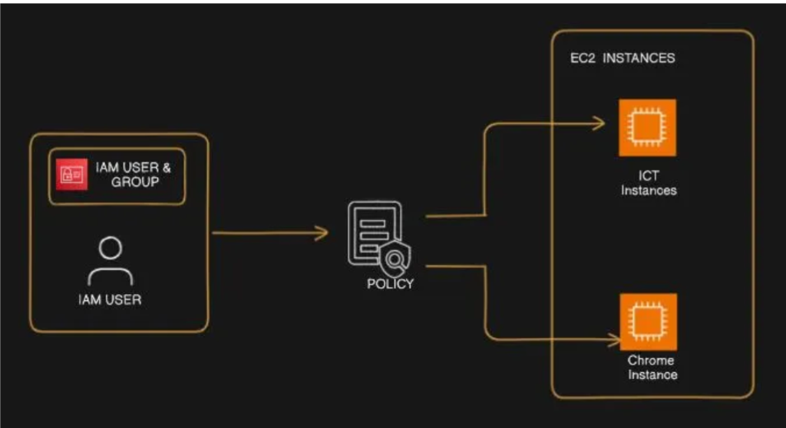

# Cloud-Security-with-IAM-Access-Controls

Cloud Security is at the heart of every successful cloud deployment — and understanding how to manage access is the first step. In this project, you will explore how to implement and manage security in the cloud using **AWS Identity Access and Management (IAM)**. The goal of the project is to understand how IAM steps helps you control who can access specific AWS resources, ensuring that only authorized users can perform certain actions.

You will work with **two EC2 instances**- one serving as the **ICT environment** and the other as a **Chrome environment**. By creating IAM users, user groups, and a custom policies, you will define access boundaries between ICT and Chrome resources. Configure a account alias to enhance account identity and usability.

This hands-on project demonstrates practical cloud security management in AWS, focusing on access controls, user roles and the principle of least privilege.

## Architecture

## Objective.

The main objective of this project is to help us implement and understand secure access management within an AWS environment. You’ll learn how to:
- Launch and manage EC2 instances for different environments (ICT and Chrome).
- Create and manage IAM users, groups and policies to assign specific permissions.
- Apply IAM Policies to control access based on job roles and responsibilities.
- Apply the Principle of Least Privilege to enhance cloud security.

## Step by Step Guide
Refer: [Documentation](docs/step-by-step-guide.md)

### Step 1: Create an EC2 Instances.
Amazon EC2(Elastic Compute Cloud) allows you to launch and manage your virtual servers - called EC2 Instances in the cloud. These instances are like computers that you can use to run applications, host websites, or perform computations.

**Elastic Compute Cloud:**
**Elastic**: Can easily increase or decrease the number of servers (instances) 
depending on your workloads.
**Compute**: provides the processing power needed to run your applications.
**Cloud**: Available over the internet, can be accessed from anywhere.

